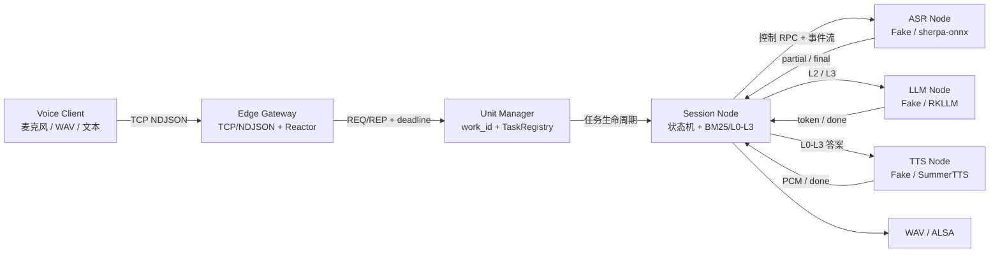

# VoxOrchestra-K1 —— 进迭时空 K1 端侧离线语音交互系统

> 「语音输入 → 本地检索 → 大模型推理 → 语音输出」全链路离线闭环，通信、调度、节点运行时全部自研。

这是 [Caden-1224/VoxOrchestra](https://github.com/Caden-1224/VoxOrchestra) 面向
**SpacemiT K1（riscv64）/ Bianbu Linux** 的适配版。仓库已合入完整上游源码，
并提供 K1 原生构建、六进程启停、网关 smoke test 和持续集成，不再是只有脚本的
适配骨架。

## K1 版本状态

| 能力 | 状态 | 说明 |
|---|---|---|
| 完整 C++17 源码与测试 | ✅ | 保留上游测试并新增 K1 生命周期门禁，共 48 项 |
| riscv64 构建 | ✅ | ZeroMQ 查找不再写死 x86_64/aarch64 路径 |
| K1 六进程部署 | ✅ | Gateway / Manager / Session / ASR / LLM / TTS |
| K1 确定性全链路 | ✅ | Fake 模型用于移植、协议、RAG、数据面与 WAV 输出验收 |
| K1 真实模型推理 | 待真机适配 | RKLLM/SummerTTS 是 RK3576 专用，不能在 K1 上冒充实测 |

### K1 快速开始

```bash
sudo apt update
sudo apt install -y build-essential cmake pkg-config libzmq3-dev cppzmq-dev nlohmann-json3-dev python3

git clone https://github.com/zww666-creater/VoxOrchestra-K1.git
cd VoxOrchestra-K1
chmod +x deploy/k1/*.sh
deploy/k1/build.sh
deploy/k1/start.sh
deploy/k1/run_smoke.sh
deploy/k1/stop.sh
```

没有 sudo 权限时，先运行 `deploy/k1/bootstrap_deps.sh` 并按提示加载用户态
依赖环境，再执行构建。

完整说明、环境变量与验收边界见 [K1 部署文档](docs/k1-deployment.md)，
上游来源与许可证说明见 [UPSTREAM.md](UPSTREAM.md)。

## 项目简介

上游项目面向华为昇腾、鲲鹏、瑞芯微 RK 系列等边缘计算平台，并以 RK3576（立创·泰山派 3M，4 GB 内存）完成真实模型验证。本适配仓库在此基础上增加 SpacemiT K1 / Bianbu Linux 支持；两种平台的实测结论严格区分。

- **端侧**：面向低资源边缘设备，覆盖昇腾、鲲鹏、RK 系列等平台；当前以 RK3576（4 GB 内存 + 6 TOPS NPU）作为真机验证平台；
- **轻量**：以 4 GB 内存为约束设计——进程级隔离、有界队列背压、无向量库常驻开销、默认构建零厂商 SDK 依赖；实际内存驻留能力以板卡实测为准；
- **多进程**：Gateway、Unit Manager、Session 与各模型节点独立进程运行，故障边界清晰，节点按需启停、可独立替换；
- **通信与推理中间件**：ZMQ 多模式通信、TCP 网关、任务调度、Node 运行时与 Backend 契约全部独立实现，系统级依赖仅 ZeroMQ 与 nlohmann-json；
- **全离线**：不依赖公网与云端，适用于无网络、隐私敏感的部署环境；
- **大模型语音交互**：统一编排 ASR、本地 RAG、RKLLM 与 TTS，已在泰山派 3M 上完成固定 WAV、板载麦克风、故障注入和 30 轮全真实闭环；Fake 后端仅用于默认构建的确定性测试。

系统以**单机多进程**为边界：不涉及跨主机集群、注册中心或故障转移；控制面 RPC（deadline + 结构化错误）与数据面异步流（有界、可取消）分离，外部客户端只访问 TCP 网关。

## 项目背景

端侧设备（树莓派、昇腾、瑞芯微 RK 系列等）处于低资源环境：算力分散、内存与通信受限、模型各自为政。把 ASR、LLM、TTS 直接串联会让业务代码同时承担模型调用、Socket、线程、超时、取消和退出逻辑，产生五类问题：

| 问题 | 后果 | 本项目对策 |
|---|---|---|
| 多个模型争抢 CPU / NPU / 内存 | 故障边界不清，一个模型崩溃拖垮全部 | 独立进程隔离，每个节点只占一份资源 |
| 模型加载与生命周期各不相同 | 无法为每次请求临时启停 | Unit Manager 统一任务生命周期（setup / exit） |
| 音频、token、PCM 是流式数据 | 不适合全部使用同步 RPC | 控制面 RPC + 数据面异步流分离 |
| 固定 `localhost` 端口互相耦合 | 节点无法独立替换 | 统一消息协议 + 动态 work_id 路由 |
| 并发请求缺少标识隔离 | 回复错位、晚到消息串入新会话 | work_id / request_id / session_id / generation 四级标识 |

本项目自研一套轻量化**多进程通信与推理中间件**——通信基座、任务调度、Node 运行时与后端契约全部独立实现，系统级依赖仅 ZeroMQ 与 nlohmann-json：统一 Node Runtime 承载所有模型节点，控制面与数据面分离，节点按需启停、可独立替换，可迁移至昇腾、鲲鹏、RK 系列等边缘平台复用。

## 项目架构图



图中控制面与数据面路径均已落地。泰山派 3M 的发布运行形态为六进程：Gateway、Unit Manager、Session、ASR、LLM 和 TTS；RAG 在 Session 内完成路由。详细进程图和请求时序见 `docs/architecture.md`。

### 三个平面

| 平面 | 内容 | 模式 | 关键约束 |
|---|---|---|---|
| 控制面 | setup / cancel / taskinfo / exit | REQ/REP RPC | deadline、结构化错误、幂等语义 |
| 数据面 | 音频帧 / ASR 结果 / token / PCM | PUB/SUB 或 PUSH/PULL | 异步、有界、可取消，不能无限堆积 |
| 外部接入 | 用户请求、流式响应 | TCP + NDJSON | 半包、粘包、超长帧、慢客户端 |

### 统一消息与标识符

统一消息为版本化 JSON 信封（`MessageEnvelope`）：`version / work_id / request_id / session_id / type / index / timestamp_ms / payload / finish / error`。四个标识符解决不同问题：

| 标识符 | 隔离粒度 | 典型场景 |
|---|---|---|
| `work_id` | 任务实例 | 一次 setup 起的整个任务生命周期 |
| `request_id` | 一次调用 | 单次 inference / cancel，回复按它归位 |
| `session_id` | 多轮会话 | 多轮对话上下文关联 |
| generation | 取消后的代际 | 取消后旧 token / PCM 直接丢弃，不串入新会话 |

## 项目设计方案

### 1. 通信基座：ZMQ 多模式通信中间件

- 统一封装 RPC / PUB-SUB / PUSH-PULL 三种通信策略（`libs/transport`），业务层按场景选择、调用方式一致，网络细节对业务屏蔽；
- **设计要点**：RPC 带 deadline 与结构化错误，超时自动重建连接保证控制面可用性；PUB-SUB 带订阅握手避免慢订阅者丢包；PUSH-PULL 用于任务分发——所有等待都有超时，不存在无限阻塞；
- 轻量序列化：版本化 JSON 信封，长度上限 1 MiB，编解码两端双重校验。

### 2. 网络接入：主从 Reactor TCP 框架

- epoll 事件循环（EventLoop / Channel / Poller），连接生命周期归属单一 loop 线程，主从 Reactor 分层；
- **设计要点**：NDJSON 增量解帧覆盖半包 / 粘包 / 超长帧 / 慢客户端写缓冲上限；所有连接回调都在 loop 线程执行，避免跨线程竞争；
- 多协议网关（`edge_gateway`）：TCP 接入 + ZMQ 控制面转发，外部用户与内部业务节点解耦。

### 3. 任务调度框架：Unit Manager 与 Node Runtime

- work_id 全局分配与路由（`TaskRegistry`），setup / inference / cancel / taskinfo / exit 状态机（`TaskChannel`），重复调用幂等；
- **设计要点**：控制面 RPC 服务注册与指令路由；轻量内存 KV 存储任务元信息，线程安全查询；任务实例交错 20 轮 E2E 无跨流；
- 数据面通道有界：容量、超时、关闭协议明确，防止慢消费者耗尽内存。

### 4. Node 业务层：标准化 Backend 契约

- **任务管理（类似线程）**：单任务实例内模型加载、推理与流式输出回调；
- **服务层控制（类似进程）**：自定义实现 setup 等接口，节点生命周期统一管理，节点间通过消息订阅交互；
- **设计要点**：五类可替换后端（`IAsrBackend / IRetriever / ILlmBackend / ITtsBackend / IAudioSink`）与统一事件（partial / final / token / pcm / done）；Node 外壳只依赖接口，默认构建全部使用确定性 Fake，真实后端按需接入——这是硬件接入的唯一变化点。

### 5. 语音交互链路：ASR → 分级 RAG → LLM → TTS

- **ASR**：流式识别，逐帧 partial、末帧 final；sherpa-onnx 流式 Zipformer 已接入（Fake 默认）；
- **分级 RAG**：L0 紧急控制（规则命中，绕过 LLM）/ L1 高置信事实直答 / L2 复杂问题带上下文 / L3 闲聊不注入伪知识；JSONL 知识库、BM25 检索与 Session 编排已接入完整链路（阈值在 `config/mock/session.json` 实测标定）；
- **LLM**：DeepSeek-R1-Distill-Qwen-1.5B W4A16 预转换模型作为首个上游基线，RKLLM 后端已接入（板端流式 token、取消过滤）；
- **TTS**：离线语音合成，消息/音频队列消除卡顿；SummerTTS 后端与 WAV / ALSA 输出均已接入；
- **会话编排**：Idle → Listening → Routing → Thinking → Speaking 状态机、generation 晚到过滤、节点级协作式取消与超时均已落地。REP 推理期间的快速打断边界见“已知限制”。

> 性能指标（时延、吞吐、内存占用）只以板卡实测为准，实测数据与方法记录于 `artifacts/`。

## 技术栈

| 技术 | 用在哪 |
|---|---|
| Linux / C++17 | 全链路实现语言：进程、线程、epoll 事件驱动 |
| ZeroMQ | 控制面 RPC 与数据面流的通信底座 |
| epoll 主从 Reactor | TCP 网关连接管理，连接生命周期一线程归属 |
| CMake + CTest | 根级构建与测试（默认构建当前 45 个测试） |
| Shell 脚本 | 演示、板卡体检与无硬件依赖验收 |

**应用场景**：无公网的全离线部署（工业、车载、机器人等边缘环境）；医疗、金融等隐私敏感场景；端侧语音交互与边缘智能应用。

## 当前状态

| 能力 | 状态 | 说明 |
|---|---|---|
| 仓库骨架、根级 CMake/CTest | ✅ | 无 Git 元数据的干净导出可复现构建，CTest 45/45 通过 |
| 统一消息信封 MessageEnvelope | ✅ | 版本化 JSON，1 MiB 上限，结构化错误码 |
| ZMQ 多模式通信 | ✅ | RPC（deadline）/ PUB/SUB（订阅握手）/ PUSH/PULL，均含超时与退出测试 |
| TCP 网关与 NDJSON 解帧 | ✅ | epoll 主从 Reactor，半包/粘包/超长帧/慢客户端处理 |
| Unit Manager / Node Runtime | ✅ | TaskChannel 状态机，Echo 三进程 E2E，双任务交错 20 轮无跨流 |
| 后端契约与确定性 Fake | ✅ | 五类接口 + 统一事件；ASR/RAG/LLM/TTS 以真实进程运行，TTS 产出 WAV |
| JSONL/BM25 分级 RAG | ✅ | L0-L3 路由、文本规范化、Top-K 检索与单元测试已落地 |
| Session 编排、取消与晚到过滤 | ✅ | 固定 WAV → Fake PCM 全链路；状态机（Idle→Listening→Routing→Thinking→Speaking）、有界文本/PCM 队列、generation 取消传播与晚到过滤；E2E + 故障注入测试覆盖 |
| WSL Mock 冻结（M1 门禁） | ✅ | 50 轮 E2E 零跨流、进程/端口无残留、request_id 日志全链关联、干净构建排除旧缓存；故障注入回归（非法输入、超长帧、未知任务、挂起兜底超时、重复 cancel/exit）；证据见 `artifacts/mock-release/` |
| 真实硬件后端（sherpa-onnx / RKLLM / SummerTTS / ALSA） | ✅ | 已接入并板端核验；默认构建关闭，仅 `VOXORCHESTRA_ENABLE_HARDWARE_BACKENDS=ON` 时构建（证据见 `artifacts/{asr,llm,tts,audio}-integration/`） |
| rag_node 真实 BM25 路由 | ✅ | 节点内 KnowledgeStore + Bm25Index + Router（L0-L3 阈值/关键词参数化），21 条测试集冻结路由决策；与 embedded 路由同源实现 |
| voice_cli 客户端 | ✅ | 现场语音交互入口：TCP NDJSON 直连网关，setup/inference/cancel/taskinfo/exit 全协议；非阻塞 connect 以 getpeername 权威确认（RST 竞态防御）、失败路径不打印空信封摘要、晚到取消静默（同步转发已知限制） |
| 数据面异步流（控制面/数据面分离） | ✅ | 统一信封 `type=event` 承载流式后端事件（partial/final/token/done/pcm，PCM base64）；主题 `<work_id>/<request_id>/` 前缀精确过滤；EventPublisher/EventSubscriber 订阅握手（slow joiner 防御）；asr/llm/tts 节点推理中实时发布（--events/--events-sync，缺省不发布） |
| 会话侧网络后端（session_node --backend net） | ✅ | NetAsr/NetLlm/NetTts 与本地 Fake 同契约：控制面 RPC 上行（setup/inference/cancel）+ 数据面事件订阅回放；RpcClient 异步两段式（call_async/poll_response）、事件流 finish 与 RPC 响应双信号判定完成、取消/超时后 REQ 状态机重建；默认 embedded 保持无硬件基线；数据面全链路 E2E 纳入当前 45/45 回归 |
| 泰山派 3M 全真实链路 | ✅ | 固定 WAV、板载麦克风、故障注入与 30 轮稳定性均完成；30/30 成功，180 份进程日志中无 Fake/Mock 运行标记 |

## 快速开始

要求：WSL / Linux，CMake ≥ 3.22，C++17 编译器，libzmq3-dev（4.3.x）、cppzmq-dev 与 nlohmann-json3-dev。默认构建**不依赖** NPU SDK、厂商 Runtime 或声卡。

```bash
cmake --preset wsl-debug
cmake --build --preset wsl-debug -j8
ctest --preset wsl-debug        # 45 个测试
```

无硬件依赖可用 `scripts/check_no_hw_deps.sh` 逐二进制验收（ldd 检查 rkllm / sherpa / onnx / asound 等链接）。

## 演示（Mock 全链路）

五节点单 Manager 轮转路由：

```bash
scripts/demo_mock_chain.sh
```

一键拉起五节点 + Manager + 网关，展示 work_id 轮转路由、逐节点推理输出、TTS 产出的 WAV 与 SIGTERM 优雅退出；日志与音频落在 `/tmp/voxorchestra-demo/`。

Session 编排全链路（固定 WAV → Fake PCM）：

```bash
scripts/demo_mock_session.sh
```

一键拉起 session_node + Manager + 网关，展示四类路由（L0 控制 / L1 直答 / L2 带上下文 / L3 闲聊）、固定 WAV 完整链路、taskinfo 队列统计与 SIGTERM 优雅退出；输出 1 秒 WAV 落在 `/tmp/voxorchestra-session/`（Fake TTS 为 500 Hz 测试音，实际内容见各请求 `final_text`，真实语音 SummerTTS 已接入）。

单条协议交互（手动探测）：

```bash
python3 scripts/gateway_probe.py 9100 '{"version":1,"type":"setup","request_id":"s-1"}'
# → {"version":1,"work_id":"w-0","type":"ack",...}

python3 scripts/gateway_probe.py 9100 \
  '{"version":1,"type":"inference","work_id":"w-1","request_id":"r-1","payload":{"text":"3"}}'
# → 逐帧 partial 汇总后的 final 文本
```

## 板端部署（全真实链路）

泰山派 3M（RK3576，官方 Ubuntu 24.04 镜像）部署入口见
`deploy/taishanpi3m/`：`build.sh` 构建硬件 Backend，`check_deployment.sh`
核对程序、配置、模型与动态库，`start.sh` 启动并 setup 六个后台服务，
`stop.sh` 负责幂等停止与超时强制退出。板端配置为
`config/taishanpi3m/session.json`。部署包明确排除模型、厂商 SDK、动态库、
凭据和原始日志；完整方法见 `docs/deployment.md`。

## 发布文档

- `docs/architecture.md`：六进程架构、控制面/数据面和端到端时序；
- `docs/protocol.md`：消息信封、标识符、动作和错误语义；
- `docs/testing.md`：默认构建、硬件构建与真机测试矩阵；
- `docs/benchmark.md`：30 轮稳定性方法、指标和证据哈希；
- `docs/troubleshooting.md`：部署、Runtime、音频与取消边界排查；
- `artifacts/release-validation/summary.md`：`v0.1.0` 发布候选门禁摘要。

## 已知限制

- DeepSeek-R1-Distill-Qwen-1.5B 在当前板卡上的单次回答约 30–60 秒，这是模型与硬件的性能边界；
- RKLLM Runtime 1.2.0 与 RKNPU 驱动 0.9.8 在长时运行中存在性能劣化，需结合温度、频率和 RSS 观察；
- 麦克风入口当前固定采集 3 秒，不是 VAD 常驻流式输入；
- ZeroMQ REP 正在推理时不能插队处理 cancel，L0 路由承担停止/取消类请求的快速路径。

这些限制不影响固定 WAV、现场麦克风、故障注入和全真实 30 轮功能门禁，
也不应被描述为已经解决。

## 设计约定

| 项 | 约定 |
|---|---|
| 节点端口 | echo `19200` / asr `19201` / rag `19202` / llm `19203` / tts `19204` / session `19210` |
| 网关端口 | `9100` |
| 音频格式 | 16 kHz 单声道 16-bit，20 ms 帧（320 采样） |
| 帧上限 | 单帧 1 MiB（解帧器与信封双重限制，超限断开） |
| 构建目录 | `build-wsl` / `build-taishanpi3m` 等按平台命名，不提交 |

## 项目结构

```text
libs/        通用库：common / protocol / transport / network / task_registry / runtime / rag / session / dataplane（数据面事件通道）
backends/    可替换实现：fake（默认）/ net（远端节点代理）/ sherpa_onnx / rkllm / summer_tts / alsa
apps/        独立进程：edge_gateway / unit_manager / session_node / asr_node / rag_node / llm_node / tts_node / voice_cli
tests/       unit / contract / integration / e2e / fault
deploy/      部署：docker / systemd / taishanpi3m
config/      运行配置：mock / taishanpi3m
data/        知识库与固定输入：knowledge / fixtures
scripts/     演示与验收脚本
artifacts/   工程记录：环境、版本链与验收证据
docs/        设计文档（随开发补齐）
```

## 测试与证据

- 单元测试：协议、解帧、Reactor、任务注册表、运行时状态机、五类 Fake 契约；
- 集成测试：ZMQ 三模式真实收发、TCP 服务器、网关、三进程 Echo E2E、五节点 E2E；
- 证据目录 `artifacts/`：按能力记录命令、版本、测试、失败与缺陷；
- 版本链（板卡 → 镜像/BSP → 内核 → NPU 驱动 → Runtime → 模型）记录于 `artifacts/environment-preflight/versions.txt` 和 `artifacts/release-validation/versions.tsv`。

## 第三方组件、模型与许可

- `THIRD_PARTY_NOTICES.md`：第三方组件登记与许可边界（nlohmann-json 与 ZeroMQ 均由系统包引入）；
- `models/README.md`：模型获取与校验方式（模型文件不入库）；
- `third_party/README.md`：第三方源码/SDK 获取说明（源码不入库）。
