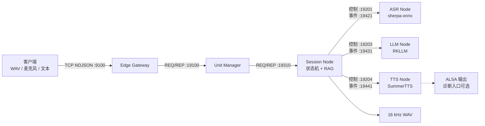
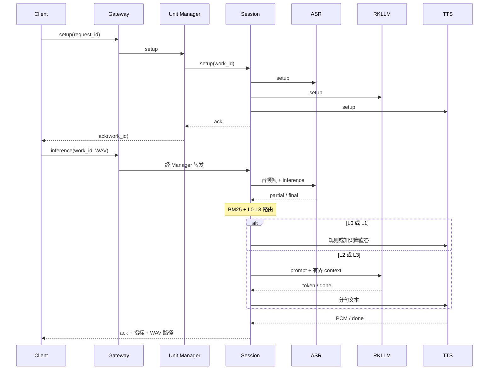

# 架构与运行时拓扑

## 发布运行形态

泰山派 3M 的发布入口常驻六个进程。RAG 不单独常驻，而是在 Session
进程中使用 JSONL 知识库、BM25 和 L0-L3 规则完成路由。

默认 x86 构建保持相同进程和协议边界，但 Backend 使用确定性 Fake，不会
配置、编译或链接 RKLLM、sherpa-onnx、ONNX Runtime、SummerTTS 或 ALSA。

## 控制面与数据面

| 平面 | 传输 | 内容 | 约束 |
|---|---|---|---|
| 外部接入 | TCP + NDJSON | setup / inference / cancel / taskinfo / exit | 单帧不超过 1 MiB，处理半包、粘包和慢客户端 |
| 控制面 | ZeroMQ REQ/REP | 生命周期和最终响应 | 每次调用有 deadline；超时后重建 REQ 状态机 |
| 数据面 | ZeroMQ PUB/SUB | partial / final / token / done / pcm | 订阅握手、主题隔离、有界队列、流内序号 |

## 全真实请求时序

## 状态、取消与晚到消息

Session 状态为 `Idle -> Listening -> Routing -> Thinking -> Speaking -> Idle`。
新请求递增 generation；旧 generation 或旧 request_id 的 token/PCM 被丢弃，
防止取消后的结果串入下一轮。文本和 PCM 队列均有容量与 push 超时，响应中
上报峰值和丢弃计数。

控制面使用 REQ/REP。后端推理占用 REP 处理时，cancel 不能在同一 REP 通道
插队；停止、取消类自然语言优先由 L0 路由绕过 LLM。该边界不是常驻流式
抢占，不能描述为已经解决。

## 故障边界

- 模型分别位于 ASR、LLM、TTS 进程，单节点退出不会破坏其他模型内存；
- `start.sh` 在任一启动或 setup 失败时回滚六个进程并保留日志；
- `stop.sh` 校验 PID 对应的 `/proc/<pid>/comm`，先 SIGTERM，20 秒后 SIGKILL；
- PUB/SUB socket 使用 `linger=0`，发布端先退出时不阻塞 ZeroMQ context 析构。
